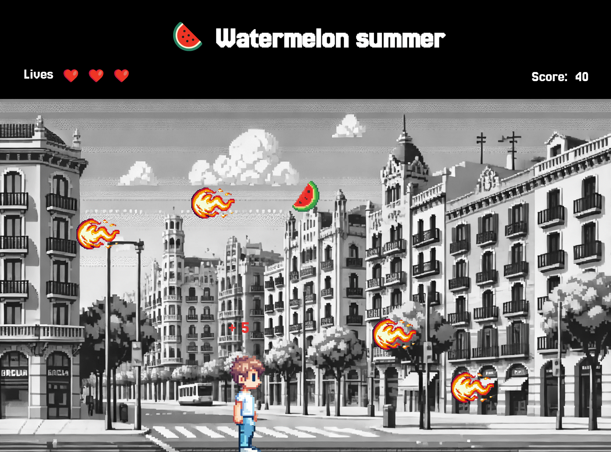

# Sant Jordi (ish)

## Description
Single player run and jump game which is in a way inspired by Sant Jordi where the player can move horizontally and vertically in order to catch roses which give him points and avoid fireballs which take away is lives.

## Code structure
Game entities (player, roses and fireballs) are object instances of their corresponding classes among which there is a hierarchy so that they share some of attributes for consistency and and methods for code reuse. For example, the parent class for all three moving entities takes care of moving those entities and making sure they don't go outside the game area. 

An endless loop using internalGameLoop takes care of calling the different functions to keep the game going such as creating and moving inanimate entities, moving the player, checking for collisions, etc.

Almost all DOM manipulation is done outside the classes which only take care of the underlying logic.

## Game visuals
All images are kind of nostalgic pixel art created with AI and tweaked in Figma.

